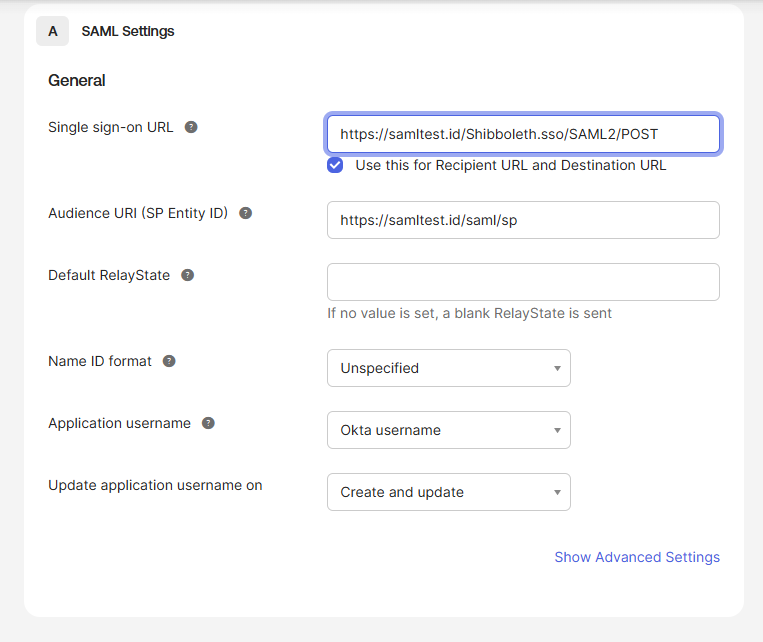
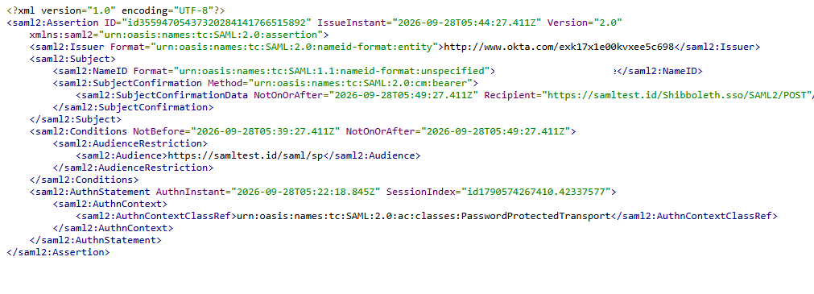
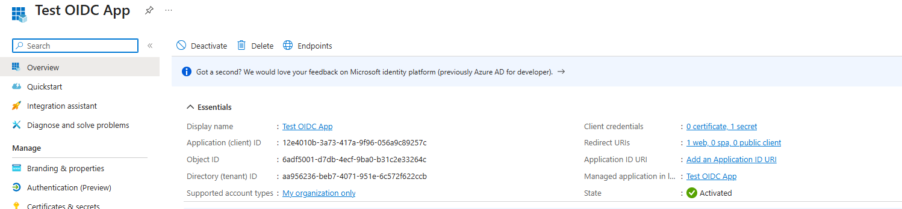
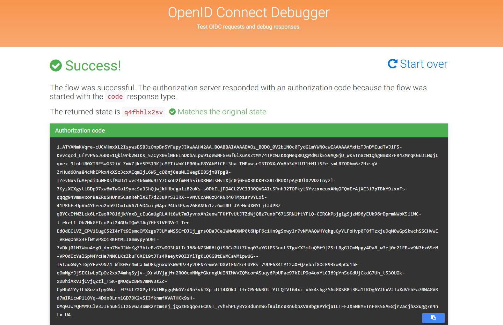
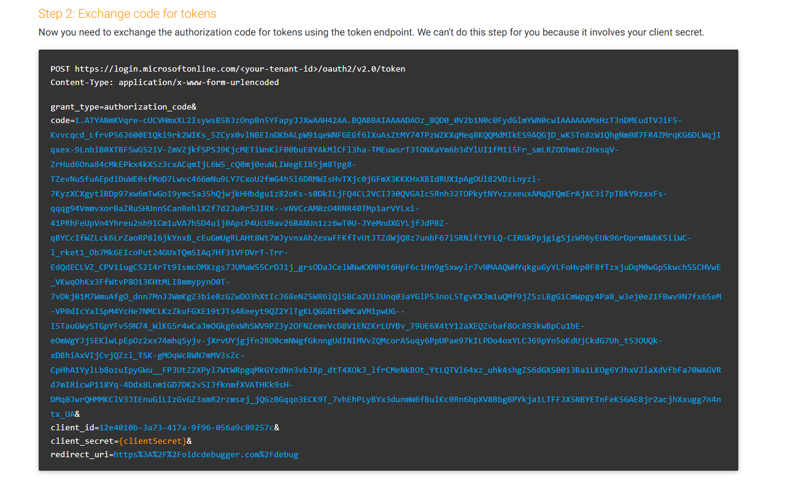
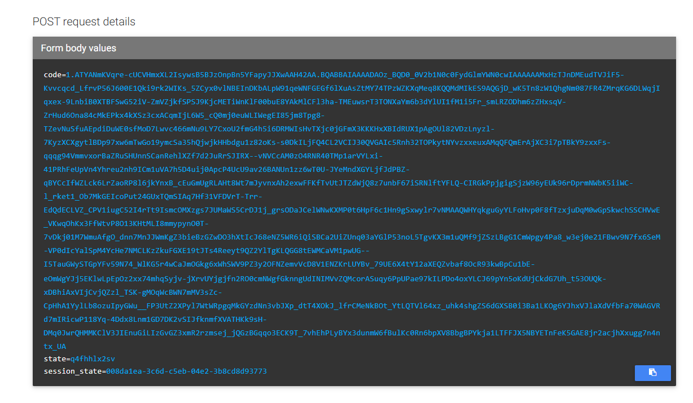
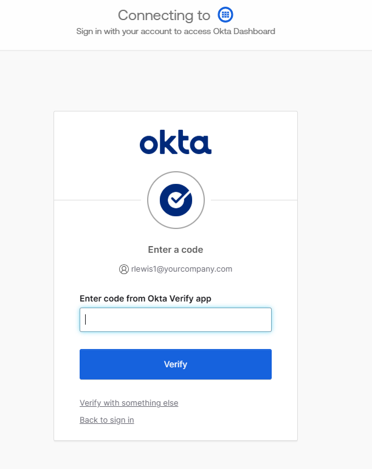
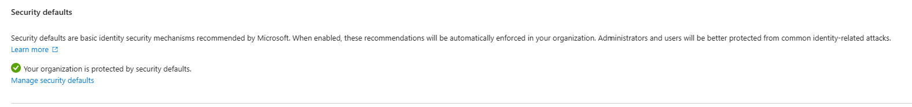
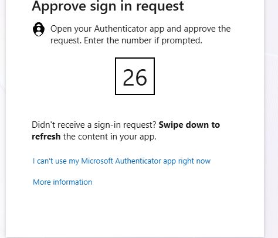

# SSO & MFA Lab — Okta (SAML) and Microsoft Entra ID (OIDC)

A hands-on identity lab that configures single sign-on (SSO) and multi-factor authentication (MFA) in two major identity platforms, using both major federation protocols: **SAML 2.0** in Okta and **OpenID Connect (OIDC)** in Microsoft Entra ID.

## The Problem

Organizations don't want every application managing its own passwords. They want users to prove who they are once, to a central identity provider, and have applications trust that proof. They also want a second factor guarding that single login, because one stolen password would otherwise open every connected app. Two protocols dominate this space, so an IAM engineer needs to work with both.

## What I Built

| Platform | Protocol | What I configured | MFA mechanism |
|---|---|---|---|
| Okta (free Integrator org) | SAML 2.0 | Custom SAML app integration, test users, app assignment | App Sign-In Policy requiring any 2 factor types (Okta Verify) |
| Microsoft Entra ID (free tenant via an Azure free account) | OpenID Connect | App registration with client ID and secret, tested with OIDC Debugger | Security Defaults with Microsoft Authenticator number matching |

All users are fake test accounts created for this lab.

## SAML vs. OIDC

Both protocols answer the same question ("this identity provider vouches for this user") in different formats.

- **SAML** is the older, established standard, common in enterprise software. The identity provider sends a signed XML *assertion*. Setup centers on an **ACS URL** (where the assertion is delivered) and an **Audience URI / Entity ID** (which app it's meant for).
- **OIDC** is built on top of OAuth 2.0 and is the default for modern web and mobile apps. It uses lightweight JSON-based tokens. Setup centers on a **client ID**, a **client secret**, a **redirect URI**, and **scopes**.

Real environments contain both, which is why the lab builds one of each.

## Part 1: Okta SAML

I built a custom SAML 2.0 app integration in Okta, since Okta's older prebuilt test app was no longer available in the catalog. The Single sign-on URL (ACS URL) and Audience URI were pointed at a public SAML test service.



I created a test user natively in Okta and assigned it to the app. The assignment is the **authorization** step: a user can authenticate successfully and still be blocked from an app they were never assigned to. Okta and Entra keep separate user directories, so each needed its own test users.

<!-- Optional: add a screenshot of the app's Assignments tab here

-->

To inspect what Okta issues, I used Okta's built-in **Preview the SAML Assertion** tool. (The NameID value is redacted.)



What the assertion shows:
- **Issuer:** Okta, vouching for the user's identity
- **Recipient and Audience:** match the ACS URL and Entity ID configured in the app
- **NotBefore / NotOnOrAfter:** the assertion is valid for a 10-minute window, limiting replay
- **AuthnContext:** how the user authenticated

**Note:** this is Okta's preview of the assertion, generated from an admin session. It does not show the digital signature, and it does not by itself demonstrate MFA. See Part 3.

## Part 2: Microsoft Entra ID OIDC

I registered an application in Entra (single-tenant, web platform, redirect URI `https://oidcdebugger.com/debug`) and generated a client ID and client secret.



- The **client ID** is public: it identifies the app.
- The **client secret** is a credential only the app's backend should hold. It proves the *application* is legitimate, which is a separate check from the *user* logging in. The secret value is never shown or committed in this repository.

I tested the flow with OIDC Debugger, entering the client ID and tenant, then signing in as an Entra test user. The authorization server returned an authorization code, and the returned `state` matched the original request.



The debugger then shows the next step, which a real application's backend performs: exchanging the code for tokens at the token endpoint using the client ID **and client secret**. The debugger can't do this step itself because it doesn't hold the secret.





**Scope of this test:** it verified the authorization-code leg of the flow (user authentication and code issuance). I did not execute the token exchange or inspect an ID token.

## Part 3 — MFA in Both Platforms

### Okta: App Sign-In Policy

The app's sign-in policy rule requires **any 2 factor types** before access is allowed. That count is the setting that turns password-only login into MFA. Additional constraints require user interaction with the possession factor, and re-authentication every 12 hours.


Verification: signing in as a test user in a fresh private window, Okta interrupted the login and required a code from Okta Verify before granting access.



### Entra: Security Defaults

Entra's Conditional Access requires a paid Entra ID P1/P2 license, which the free tenant doesn't include. I enabled **Security Defaults** instead, Microsoft's tenant-wide baseline that requires MFA for all users.



Verification: signing in as a test user, Entra required approval in Microsoft Authenticator using **number matching**: the login screen shows a number the user must enter in their authenticator app. This protects against MFA fatigue attacks, where an attacker with a stolen password spams approval prompts hoping the user taps "Approve" without checking.



**Security Defaults vs. Conditional Access:** Security Defaults is all-or-nothing (MFA for everyone). Conditional Access is the granular tool, with rules such as requiring MFA for one app, or blocking sign-ins from certain locations. Okta's App Sign-In Policy plays a similar role on the Okta side, with rules evaluated in priority order like an if/else chain.

## Challenges & What I Learned

- **Microsoft 365 Developer Program sandbox denied.** I initially tried to use the sandbox environment that comes with the Microsoft 365 Developer Program but it didn't seem that my account was eligible. Since Azure accounts include a default Entra tenant, I went that route to start working within the Entra environment.
- **Okta's generic SAML test app no longer exists in the catalog.** The catalog no longer offered a generic SAML test app, so I built a custom SAML app integration, which meant filling in the ACS URL and Audience URI myself and configuring the actual trust relationship.
- **The public SAML test service (samltest.id) had been retired.** The final redirect to the test service failed with a connection-refused error. Since Okta had already authenticated the user and issued the assertion before that redirect, I verified the identity provider side using Okta's built-in assertion preview.
- **"Password expired" right after account creation is normal.** When an admin sets an initial password, Okta requires the user to choose a new one at first login.
- **Conditional Access required a paid Entra ID P1/P2 license.** Since curating conditional access required a different Entra membership, I used Microsoft's Security Defaults and documented the distinction between the two being that Secruity Defaults require every app the user is assigned to require MFA and the Conditional Access allows for MFA rules to be applied to the apps you specifically want them to apply to.

## Limitations & Next Steps

- No live end-to-end SAML round trip with a working service provider. Next step: stand up a self-hosted test service provider.
- The OIDC token exchange wasn't executed. Next step: complete it from a backend call and decode the ID token.
- No Conditional Access policies (location, device). Next step: build them in a tenant with the required license.


## Security Notes

- No secrets are committed to this repository. The client secret was never displayed or stored here.
- All users are fake test accounts. Real email addresses were redacted from screenshots.

## Repository Structure

```
okta-entra-sso-lab/
├── README.md
└── docs/
    └── screenshots/
        ├── Okta_SAML_app_config_SS.png
        ├── Okta_assertion_preview_SS.png
        ├── Okta_App_SignIn_Policy_SS.png
        ├── Okta_Auth_Code_Prompt_SS.png
        ├── Test_App_Registration_Overview_Entra_SS.png
        ├── OIDC_Debugger_SS_1.png
        ├── OIDC_Debugger_SS_2.png
        ├── OIDC_Debugger_SS_3.png
        ├── Security_Defaults_Entra_SS.png
        └── Number_Matching_Prompt_MFA_Entra_SS.png
```

---

